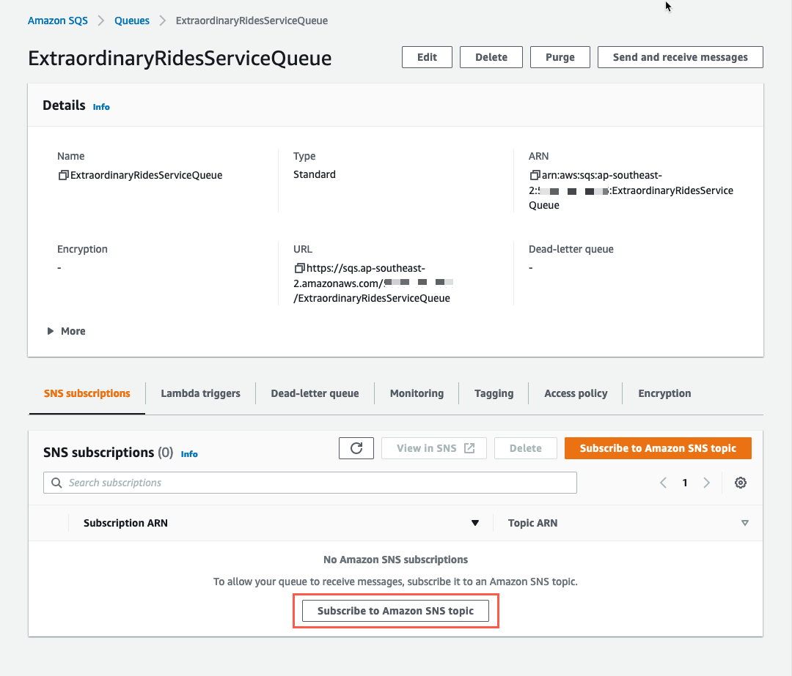
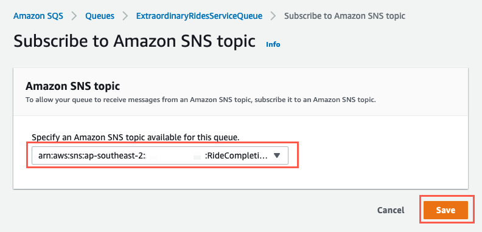
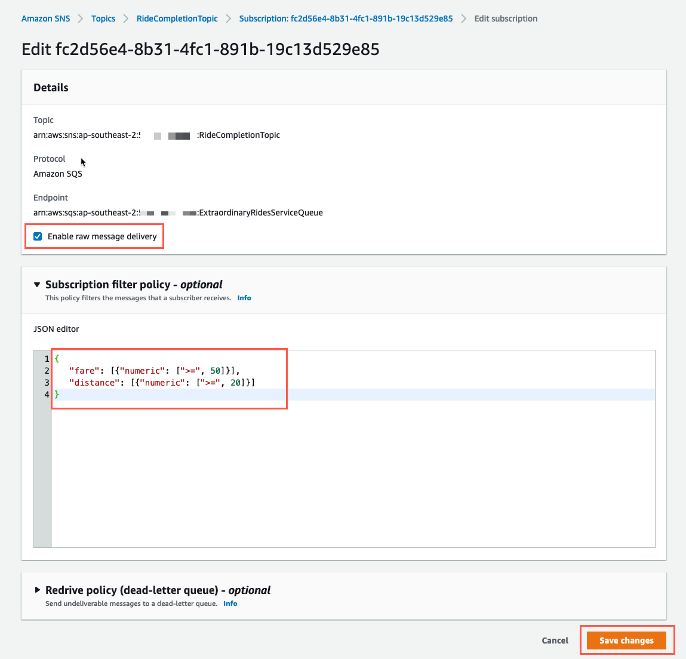

+++
title = "Console"
disableToc = true
hidden = true
+++

#### 1. Create a new Amazon SQS queue

In your **[Amazon SQS console](https://console.aws.amazon.com/sqs/home?)**, select **Create New Queue** in top left corner or click **Get Started Now** in the center of the page, if it's your first queue in this region.

{}

{}

Enter `%INITIALS%-ExtraordinaryRidesServiceQueue` as **Queue Name**, make sure **Standard Queue** is highlighted and the queue name is prefixed with your initials. Click **Create Queue**.


{}

{}

#### 2. Create a new subscription

After creating `%INITIALS%-ExtraordinaryRidesServiceQueue`, click the **Subscribe to Amazon SNS topic** button.

{}

{}

From the drop down, select the `%INITIALS%-RideCompletionTopic` ARN and click **Save**.

{}

{}

#### 3. Validate the subscription confirmation

Browse to your **[Amazon SNS console](https://console.aws.amazon.com/sns/v3/home?#/topics)** to list your existing topics. Select the `%INITIALS%-RideCompletionTopic` and verify, the subscription has the status **Confirmed**.

{}

{}

#### 4. Add the filter to the subscription

Click on the subscription id for the `%INITIALS%-ExtraordinaryRidesServiceQueue subscription` and click on **Edit** to add our subscription filter policy. In the subscription filter policy section, add out filter policy. Click **Save changes**.

{}
```
{
   "fare": [{"numeric": [">=", 50]}],
   "distance": [{"numeric": [">=", 20]}]
}
```
{}

{}

{}

#### 5. Grant permissions to our function to access the Amazon SQS queue

In your **[Amazon IAM console](https://console.aws.amazon.com/iam)**, select **Roles** in the left navigation. Use the filter text box to find the role with the name `%INITIALS%-wild-rydes-async-msg-2-ExtraordinaryRidesService-...` (assuming your have chosen `%INITIALS%-wild-rydes-async-msg-2` as your stack name).

{}

{}

Click on the role name and click **Add inline policy** to attache another one.

{}

{}

Select the **JSON** tab and passed the following policy statement into it, after you have substitute <<...>> and %INITIALS% with the correct values. It will add the permission to your Lambda function to access the Amazon SQS queue:

{}
```bash
{
    "Statement": [
        {
            "Effect": "Allow",
            "Action": [
                "sqs:ChangeMessageVisibility",
                "sqs:ChangeMessageVisibilityBatch",
                "sqs:DeleteMessage",
                "sqs:DeleteMessageBatch",
                "sqs:GetQueueAttributes",
                "sqs:ReceiveMessage"
            ],
            "Resource": "arn:aws:sqs:<<AWS REGION>>:<<AWS ACCOUNT ID>>:%INITIALS%-ExtraordinaryRidesServiceQueue"
        }
    ]
}
```
{}

{}
Make sure you provide the AWS ACCOUNT ID in the form of XXXXXXXXXXXX and not XXXX-XXXX-XXXX!
{}

Click **Review policy** and enter the **Name** `ExtraordinaryRidesServiceRolePolicy0`. Click **Create policy**. To validate this step, select on the role again and your should see 2 policies attached to your role, including the one you just have created:  

{}

{}


#### 6. Add the Amazon SQS queue as event source for your Customer Notification Service AWS Lambda function

Open your **[AWS Lambda console](https://console.aws.amazon.com/lambda/home?#/functions)** and select **Functions** in the left navigation. Click on the function with the name `%INITIALS%-wild-rydes-async-msg-2-ExtraordinaryRides...` (assuming your have chosen `%INITIALS%-wild-rydes-async-msg-2` as your stack name). Click on the **+ Add Trigger** button on the left side of the page:

{}

{}

On the following page, select `SQS` as the event source for this AWS Lambda function. For the **SQS queue**, select the `%INITIALS%-ExtraordinaryRidesServiceQueue` and set the **batch size** to `1`. Don't forget to **enable the trigger**, before you click the **Add** button in the lower right corner.

{}

{}

After some seconds, the trigger will be enabled and and you are ready to go (you may have to refresh the site a few times).

{}

{}
